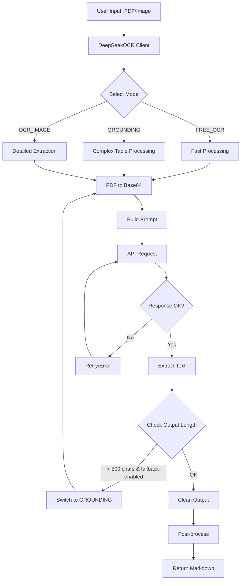
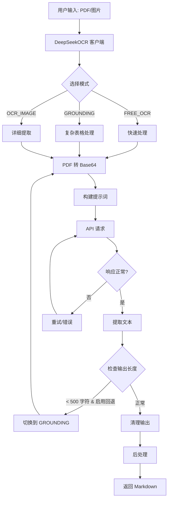

# DeepSeek-OCR-SDK

[](https://pypi.org/project/deepseek-ocr/)
[](https://opensource.org/licenses/MIT)
[](https://www.python.org/downloads/)
[](https://github.com/psf/black)

[English](#english) | [中文](#中文)

---

<a name="english"></a>

## English

### Overview

**DeepSeek-OCR-SDK** is a simple and efficient Python SDK for the DeepSeek OCR API. It provides a clean, production-ready interface for converting documents (PDF, images) to Markdown text with high accuracy and performance.

### Key Features

- **Simple API**: Clean and intuitive interface, minimal learning curve
- **Three OCR Modes**:
  - `FREE_OCR`: Fast mode for 80% of use cases (3.95-10.95s)
  - `GROUNDING`: Advanced mode for complex tables (5.18-8.31s)
  - `OCR_IMAGE`: Detailed word-level extraction (19-26s)
- **Intelligent Fallback**: Automatically switches modes for better quality
- **Batch Processing**: Process multiple documents efficiently with progress tracking
- **Async & Sync**: Full support for both asynchronous and synchronous workflows
- **Type Hints**: 100% type coverage for better IDE support

### Installation

#### Using pip

```bash
pip install deepseek-ocr
```

#### Using uv (recommended)

```bash
uv add deepseek-ocr
```

#### Install from source

```bash
# Clone repository
git clone https://github.com/BukeLy/DeepSeek-OCR-SDK
cd DeepSeek-OCR-SDK

# Install with uv
uv sync

# Or install with pip
pip install -e .
```

### Quick Start

```python
from deepseek_ocr import DeepSeekOCR

# Initialize client (choose your API provider)
client = DeepSeekOCR(
    api_key="your_api_key",
    base_url="https://api.siliconflow.cn/v1/chat/completions"  # or your provider's endpoint
)

# Parse document
text = client.parse("document.pdf")
print(text)
```

**Note**: This SDK supports any OpenAI-compatible API endpoint that provides the DeepSeek-OCR model. Currently known provider: **SiliconFlow** (`api.siliconflow.cn`). DeepSeek's official API does not support the DeepSeek-OCR model.

### Architecture



### Usage Examples

#### Basic Usage

```python
from deepseek_ocr import DeepSeekOCR

client = DeepSeekOCR(
    api_key="your_api_key",
    base_url="https://api.siliconflow.cn/v1/chat/completions"  # or your provider's endpoint
)

# Simple document
text = client.parse("invoice.pdf", mode="free_ocr")

# Complex table
text = client.parse("statement.pdf", mode="grounding")

# Custom DPI
text = client.parse("document.pdf", dpi=300)
```

#### Multi-Page PDF Processing

**⚠️ Breaking Change in v0.2.0**: PDF processing now handles **all pages by default**.

```python
from deepseek_ocr import DeepSeekOCR

client = DeepSeekOCR(
    api_key="your_api_key",
    base_url="https://api.siliconflow.cn/v1/chat/completions"
)

# Process all pages (new default behavior)
text = client.parse("multi_page.pdf")
# Returns: Page 1 content\n\n---\n\nPage 2 content\n\n---\n\nPage 3 content

# Process only the first page (old behavior)
text = client.parse("multi_page.pdf", pages=1)

# Process specific pages (e.g., pages 1, 3, and 5)
text = client.parse("multi_page.pdf", pages=[1, 3, 5])

# Process a range of pages
text = client.parse("multi_page.pdf", pages=list(range(1, 6)))  # Pages 1-5
```

**Note**: Processing multiple pages will increase API usage and costs proportionally. Each page is processed independently with intelligent per-page fallback.

#### Async Usage

```python
import asyncio
from deepseek_ocr import DeepSeekOCR

async def main():
    client = DeepSeekOCR(
        api_key="your_api_key",
        base_url="https://api.siliconflow.cn/v1/chat/completions"  # or your provider's endpoint
    )
    text = await client.parse_async("document.pdf")
    print(text)

asyncio.run(main())
```

#### Batch Processing

```python
import asyncio
from pathlib import Path
from deepseek_ocr import DeepSeekOCR, BatchProcessor

async def batch_example():
    client = DeepSeekOCR(
        api_key="your_api_key",
        base_url="https://api.siliconflow.cn/v1/chat/completions"  # or your provider's endpoint
    )
    processor = BatchProcessor(client, max_concurrent=5)

    files = list(Path("docs").glob("*.pdf"))
    summary = await processor.process_batch(
        files,
        mode="free_ocr",
        show_progress=True
    )

    summary.print_summary()

asyncio.run(batch_example())

### Vision-Language Model (VLM) Client

The SDK includes a lightweight VLM client for multimodal chat completions.
It follows an OpenAI-compatible chat completions interface where you can
send both images and text as a single message. Use it like:

```python
from deepseek_ocr import vlm

client = vlm.VLM(
    api_key="your_api_key",
    base_url="http://localhost:8000/v1",  # Replace with your provider's base URL
)

result = client.chat.completions.create(
    model="Qwen3-VL-8B",
    messages=[
        {
            "role": "user",
            "content": [
                {
                    "type": "image_url",
                    "image_url": {"url": "https://help-static-aliyun-doc.aliyuncs.com/file-manage-files/zh-CN/20241022/emyrja/dog_and_girl.jpeg"},
                },
                {"type": "text", "text": "What is happening in this image?"},
            ],
        }
    ],
)

print(result["choices"][0]["message"]["content"])
```

This client also supports async calls via `create_async`.

```

### Mode Selection Guide

| Document Type | Recommended Mode | Reason |
|---------------|-----------------|---------|
| Simple text (invoice, letter) | `FREE_OCR` | Fastest, 80% accuracy |
| Complex tables (≥20 rows) | `GROUNDING` | Better structure preservation |
| Simple tables (<10 rows) | `FREE_OCR` | Avoids truncation issues |
| Mixed content | `GROUNDING` | Handles complexity well |

### Configuration

#### Environment Variables

```bash
export DS_OCR_API_KEY="your_api_key"
export DS_OCR_BASE_URL="https://api.siliconflow.cn/v1/chat/completions"  # REQUIRED: Set to your provider's endpoint
export DS_OCR_MODEL="deepseek-ai/DeepSeek-OCR"
export DS_OCR_TIMEOUT=60
export DS_OCR_MAX_TOKENS=4000
export DS_OCR_DPI=200
export DS_OCR_FALLBACK_ENABLED=true
export DS_OCR_FALLBACK_MODE="grounding"
export DS_OCR_MIN_OUTPUT_THRESHOLD=500
export DS_OCR_PAGE_SEPARATOR="\n\n---\n\n"  # Separator between pages in multi-page PDFs

# VLM Configuration (NEW)
export VLM_API_KEY="your_vlm_api_key"  # Defaults to DS_OCR_API_KEY if not set
export VLM_BASE_URL="https://api.siliconflow.cn/v1/chat/completions"  # Defaults to DS_OCR_BASE_URL if not set
export VLM_MODEL_NAME="Qwen3-VL-8B"
export VLM_TIMEOUT=60
export VLM_MAX_TOKENS=4000
export VLM_TEMPERATURE=0.0

# Rate Limiting Configuration (NEW)
export DS_OCR_REQUEST_DELAY=0.0  # Delay in seconds between requests (0 = no delay)
export DS_OCR_ENABLE_RATE_LIMIT_RETRY=true  # Enable automatic retry on 429 errors
export DS_OCR_MAX_RATE_LIMIT_RETRIES=3  # Maximum number of retries for rate limit errors
export DS_OCR_RATE_LIMIT_RETRY_DELAY=5.0  # Initial delay before retrying (uses exponential backoff)
```

**Available API Providers**:
- **SiliconFlow**: `https://api.siliconflow.cn/v1/chat/completions` (Verified ✅)
- **Others**: Contact third-party API providers for DeepSeek-OCR support

**Note**: DeepSeek's official API (`api.deepseek.com`) does not support the DeepSeek-OCR model.

#### Programmatic Configuration

```python
from deepseek_ocr import DeepSeekOCR, OCRConfig

# Method 1: Direct initialization
client = DeepSeekOCR(
    api_key="your_api_key",
    base_url="https://api.siliconflow.cn/v1/chat/completions",  # or your provider's endpoint
    timeout=120,
    dpi=300
)

# Method 2: Using config object (requires DS_OCR_BASE_URL environment variable)
config = OCRConfig.from_env(api_key="your_api_key", dpi=300)
client = DeepSeekOCR(api_key=config.api_key, base_url=config.base_url)
```

### Rate Limiting

The SDK provides built-in rate limiting to prevent hitting API limits (TPM/RPM).

#### Manual Rate Control

Set a delay between requests to stay within rate limits:

```python
from deepseek_ocr import DeepSeekOCR

# Set 2-second delay between requests
client = DeepSeekOCR(
    api_key="your_api_key",
    base_url="https://api.siliconflow.cn/v1/chat/completions",
    request_delay=2.0  # Delay in seconds between API requests
)

# The SDK will automatically wait between requests
text1 = client.parse("doc1.pdf")  # Request made immediately
text2 = client.parse("doc2.pdf")  # Waits 2 seconds from previous request
```

#### Automatic 429 Retry

The SDK automatically handles rate limit errors (429) with exponential backoff:

```python
from deepseek_ocr import DeepSeekOCR, RateLimitError

client = DeepSeekOCR(
    api_key="your_api_key",
    base_url="https://api.siliconflow.cn/v1/chat/completions",
    enable_rate_limit_retry=True,  # Enable auto-retry (default: True)
    max_rate_limit_retries=3,  # Max retry attempts (default: 3)
    rate_limit_retry_delay=5.0  # Initial backoff delay (default: 5.0s)
)

try:
    # If rate limited, SDK will retry up to 3 times with exponential backoff:
    # - 1st retry: wait 5 seconds
    # - 2nd retry: wait 10 seconds
    # - 3rd retry: wait 20 seconds
    text = client.parse("document.pdf")
except RateLimitError as e:
    print(f"Rate limit exceeded after retries: {e}")
```

#### Combining Both Approaches

For best results, combine request delay with retry:

```python
client = DeepSeekOCR(
    api_key="your_api_key",
    base_url="https://api.siliconflow.cn/v1/chat/completions",
    request_delay=1.0,  # Wait 1 second between requests
    enable_rate_limit_retry=True,  # Auto-retry on 429
    max_rate_limit_retries=3
)
```

**TPM/RPM Calculation Examples**:

For L0 tier (TPM: 80,000, RPM: 1,000):
- Average 1000 tokens per request → ~80 requests/minute max
- Safe rate: 60 requests/minute → `request_delay=1.0` (1 second)

For batch processing with concurrent requests:
```python
from deepseek_ocr import BatchProcessor

client = DeepSeekOCR(
    api_key="your_api_key",
    base_url="https://api.siliconflow.cn/v1/chat/completions",
    request_delay=2.0  # 2-second delay per request
)

processor = BatchProcessor(
    client,
    max_concurrent=3  # Process 3 files concurrently
)
# Effective rate: ~0.5 requests/second (global rate limit, 1 request every 2 seconds)
```

### DPI Recommendations

- **150 DPI**: May cause hallucinations, not recommended
- **200 DPI**: ⭐ Optimal balance (recommended)
- **300 DPI**: Larger file size, minimal quality improvement

### Error Handling

```python
from deepseek_ocr import DeepSeekOCR, APIError, FileProcessingError, RateLimitError

client = DeepSeekOCR(
    api_key="your_api_key",
    base_url="https://api.siliconflow.cn/v1/chat/completions"  # or your provider's endpoint
)

try:
    text = client.parse("document.pdf")
except FileProcessingError as e:
    print(f"File error: {e}")
except RateLimitError as e:
    print(f"Rate limit error: {e.status_code} - {e}")
except APIError as e:
    print(f"API error: {e.status_code} - {e}")
except Exception as e:
    print(f"Unexpected error: {e}")
```

### Development

#### Setup Development Environment

```bash
# Clone repository
git clone https://github.com/BukeLy/DeepSeek-OCR-SDK
cd DeepSeek-OCR-SDK

# Install dependencies with uv
uv sync --all-extras

# Activate virtual environment
source .venv/bin/activate  # Linux/Mac
# or
.venv\\Scripts\\activate  # Windows
```

#### Run Tests

```bash
uv run pytest
```

#### Code Quality

```bash
# Format code
uv run black deepseek_ocr/
uv run isort deepseek_ocr/

# Type checking
uv run mypy deepseek_ocr/

# Linting
uv run flake8 deepseek_ocr/
```

### API Reference

See [API_REFERENCE.md](docs/API_REFERENCE.md) for complete API documentation.

### License

This project is licensed under the MIT License - see the [LICENSE](LICENSE) file for details.

### Acknowledgments

- DeepSeek AI for the excellent OCR model

**Disclaimer**: This is an unofficial, third-party SDK and is not affiliated with DeepSeek AI or any API service provider. Users are responsible for choosing their own API provider and complying with the provider's terms of service.

---

<a name="中文"></a>

## 中文

### 简介

**DeepSeek-OCR-SDK** 是一个简单高效的 Python SDK，用于调用 DeepSeek OCR API。它提供了简洁、生产级的接口，可以高精度、高性能地将文档（PDF、图片）转换为 Markdown 文本。

### 核心特性

- **简单易用**：API 简洁直观，学习成本低
- **三种 OCR 模式**：
  - `FREE_OCR`：快速模式，适用于 80% 的场景（3.95-10.95秒）
  - `GROUNDING`：高级模式，适用于复杂表格（5.18-8.31秒）
  - `OCR_IMAGE`：详细模式，提供词级别提取（19-26秒）
- **智能回退**：自动切换模式以获得更好的质量
- **批量处理**：高效处理多个文档，带进度跟踪
- **异步 & 同步**：完整支持异步和同步工作流
- **类型提示**：100% 类型覆盖，更好的 IDE 支持

### 安装

#### 使用 pip

```bash
pip install deepseek-ocr
```

#### 使用 uv（推荐）

```bash
uv add deepseek-ocr
```

#### 从源码安装

```bash
# 克隆仓库
git clone https://github.com/BukeLy/DeepSeek-OCR-SDK
cd DeepSeek-OCR-SDK

# 使用 uv 安装
uv sync

# 或使用 pip 安装
pip install -e .
```

### 快速开始

```python
from deepseek_ocr import DeepSeekOCR

# 初始化客户端（选择您的 API 提供商）
client = DeepSeekOCR(
    api_key="your_api_key",
    base_url="https://api.siliconflow.cn/v1/chat/completions"  # 或您的提供商端点
)

# 解析文档
text = client.parse("document.pdf")
print(text)
```

**注意**：本 SDK 支持任何提供 DeepSeek-OCR 模型的 OpenAI 兼容 API 端点。目前已知的提供商：**硅基流动** (`api.siliconflow.cn`)。DeepSeek 官方 API 不支持 DeepSeek-OCR 模型。

### 架构图



### 使用示例

#### 基础用法

```python
from deepseek_ocr import DeepSeekOCR

client = DeepSeekOCR(
    api_key="your_api_key",
    base_url="https://api.siliconflow.cn/v1/chat/completions"  # 或您的提供商端点
)

# 简单文档
text = client.parse("invoice.pdf", mode="free_ocr")

# 复杂表格
text = client.parse("statement.pdf", mode="grounding")

# 自定义 DPI
text = client.parse("document.pdf", dpi=300)
```

#### 多页 PDF 处理

**⚠️ v0.2.0 破坏性变更**：PDF 处理现在**默认处理所有页面**。

```python
from deepseek_ocr import DeepSeekOCR

client = DeepSeekOCR(
    api_key="your_api_key",
    base_url="https://api.siliconflow.cn/v1/chat/completions"
)

# 处理所有页面（新的默认行为）
text = client.parse("multi_page.pdf")
# 返回: 第1页内容\n\n---\n\n第2页内容\n\n---\n\n第3页内容

# 只处理第一页（旧的行为）
text = client.parse("multi_page.pdf", pages=1)

# 处理特定页面（例如第 1、3、5 页）
text = client.parse("multi_page.pdf", pages=[1, 3, 5])

# 处理一个范围的页面
text = client.parse("multi_page.pdf", pages=list(range(1, 6)))  # 第 1-5 页
```

**注意**：处理多个页面将按比例增加 API 使用量和费用。每个页面都独立处理，并带有智能的逐页回退机制。

#### 异步用法

```python
import asyncio
from deepseek_ocr import DeepSeekOCR

async def main():
    client = DeepSeekOCR(
        api_key="your_api_key",
        base_url="https://api.siliconflow.cn/v1/chat/completions"  # 或您的提供商端点
    )
    text = await client.parse_async("document.pdf")
    print(text)

asyncio.run(main())
```

#### 批量处理

```python
import asyncio
from pathlib import Path
from deepseek_ocr import DeepSeekOCR, BatchProcessor

async def batch_example():
    client = DeepSeekOCR(
        api_key="your_api_key",
        base_url="https://api.siliconflow.cn/v1/chat/completions"  # 或您的提供商端点
    )
    processor = BatchProcessor(client, max_concurrent=5)

    files = list(Path("docs").glob("*.pdf"))
    summary = await processor.process_batch(
        files,
        mode="free_ocr",
        show_progress=True
    )

    summary.print_summary()

asyncio.run(batch_example())

### 视觉-语言模型（VLM）客户端

SDK 增加了一个轻量级的 VLM 客户端，用于多模态对话式推理。它兼容 OpenAI 风格的 chat completions API，允许在同一条消息中发送图像和文本：

```python
from deepseek_ocr import vlm

client = vlm.VLM(
    api_key="your_api_key",
    base_url="http://localhost:8000/v1",  # 替换为您的 API 提供商地址
)

result = client.chat.completions.create(
    model="Qwen3-VL-8B",
    messages=[
        {
            "role": "user",
            "content": [
                {
                    "type": "image_url",
                    "image_url": {"url": "https://help-static-aliyun-doc.aliyuncs.com/file-manage-files/zh-CN/20241022/emyrja/dog_and_girl.jpeg"},
                },
                {"type": "text", "text": "图中描绘的是什么景象?"},
            ],
        }
    ],
)

print(result["choices"][0]["message"]["content"])
```

还可使用 `create_async` 进行异步调用。

```

### 模式选择指南

| 文档类型 | 推荐模式 | 原因 |
|---------|---------|------|
| 简单文本（发票、信件） | `FREE_OCR` | 最快，80% 准确率 |
| 复杂表格（≥20 行） | `GROUNDING` | 更好的结构保留 |
| 简单表格（<10 行） | `FREE_OCR` | 避免截断问题 |
| 混合内容 | `GROUNDING` | 处理复杂性好 |

### 配置

#### 环境变量

```bash
export DS_OCR_API_KEY="your_api_key"
export DS_OCR_BASE_URL="https://api.siliconflow.cn/v1/chat/completions"  # 必填：设置为您的提供商端点
export DS_OCR_MODEL="deepseek-ai/DeepSeek-OCR"
export DS_OCR_TIMEOUT=60
export DS_OCR_MAX_TOKENS=4000
export DS_OCR_DPI=200
export DS_OCR_FALLBACK_ENABLED=true
export DS_OCR_FALLBACK_MODE="grounding"
export DS_OCR_MIN_OUTPUT_THRESHOLD=500
export DS_OCR_PAGE_SEPARATOR="\n\n---\n\n"  # Separator between pages in multi-page PDFs

# VLM 配置（新增）
export VLM_API_KEY="your_vlm_api_key"  # 如果未设置，默认使用 DS_OCR_API_KEY
export VLM_BASE_URL="https://api.siliconflow.cn/v1/chat/completions"  # 如果未设置，默认使用 DS_OCR_BASE_URL
export VLM_MODEL_NAME="Qwen3-VL-8B"
export VLM_TIMEOUT=60
export VLM_MAX_TOKENS=4000
export VLM_TEMPERATURE=0.0

# 速率限制配置（新增）
export DS_OCR_REQUEST_DELAY=0.0  # 请求之间的延迟秒数（0 = 无延迟）
export DS_OCR_ENABLE_RATE_LIMIT_RETRY=true  # 启用 429 错误自动重试
export DS_OCR_MAX_RATE_LIMIT_RETRIES=3  # 速率限制错误的最大重试次数
export DS_OCR_RATE_LIMIT_RETRY_DELAY=5.0  # 重试前的初始延迟（使用指数退避）
```

**可用的 API 提供商**：
- **硅基流动（SiliconFlow）**：`https://api.siliconflow.cn/v1/chat/completions` (已验证 ✅)
- **其他**：联系第三方 API 提供商以获取 DeepSeek-OCR 支持

**注意**：DeepSeek 官方 API (`api.deepseek.com`) 不支持 DeepSeek-OCR 模型。

#### 编程式配置

```python
from deepseek_ocr import DeepSeekOCR, OCRConfig

# 方法 1：直接初始化
client = DeepSeekOCR(
    api_key="your_api_key",
    base_url="https://api.siliconflow.cn/v1/chat/completions",  # 或您的提供商端点
    timeout=120,
    dpi=300
)

# 方法 2：使用配置对象（需要设置 DS_OCR_BASE_URL 环境变量）
config = OCRConfig.from_env(api_key="your_api_key", dpi=300)
client = DeepSeekOCR(api_key=config.api_key, base_url=config.base_url)
```

### 速率限制

SDK 提供内置的速率限制功能，防止超过 API 限制（TPM/RPM）。

#### 手动速率控制

设置请求之间的延迟以保持在速率限制内：

```python
from deepseek_ocr import DeepSeekOCR

# 设置请求之间 2 秒延迟
client = DeepSeekOCR(
    api_key="your_api_key",
    base_url="https://api.siliconflow.cn/v1/chat/completions",
    request_delay=2.0  # API 请求之间的延迟秒数
)

# SDK 会自动在请求之间等待
text1 = client.parse("doc1.pdf")  # 立即发起请求
text2 = client.parse("doc2.pdf")  # 从上次请求起等待 2 秒
```

#### 自动 429 重试

SDK 自动处理速率限制错误（429），使用指数退避：

```python
from deepseek_ocr import DeepSeekOCR, RateLimitError

client = DeepSeekOCR(
    api_key="your_api_key",
    base_url="https://api.siliconflow.cn/v1/chat/completions",
    enable_rate_limit_retry=True,  # 启用自动重试（默认：True）
    max_rate_limit_retries=3,  # 最大重试次数（默认：3）
    rate_limit_retry_delay=5.0  # 初始退避延迟（默认：5.0秒）
)

try:
    # 如果遇到速率限制，SDK 将重试最多 3 次，使用指数退避：
    # - 第 1 次重试：等待 5 秒
    # - 第 2 次重试：等待 10 秒
    # - 第 3 次重试：等待 20 秒
    text = client.parse("document.pdf")
except RateLimitError as e:
    print(f"重试后仍超过速率限制: {e}")
```

#### 组合两种方法

为获得最佳效果，组合请求延迟和重试：

```python
client = DeepSeekOCR(
    api_key="your_api_key",
    base_url="https://api.siliconflow.cn/v1/chat/completions",
    request_delay=1.0,  # 请求之间等待 1 秒
    enable_rate_limit_retry=True,  # 启用 429 自动重试
    max_rate_limit_retries=3
)
```

**TPM/RPM 计算示例**：

对于 L0 级别（TPM: 80,000，RPM: 1,000）：
- 平均每个请求 1000 个 token → 最多 ~80 请求/分钟
- 安全速率：60 请求/分钟 → `request_delay=1.0`（1 秒）

对于具有并发请求的批处理：
```python
from deepseek_ocr import BatchProcessor

client = DeepSeekOCR(
    api_key="your_api_key",
    base_url="https://api.siliconflow.cn/v1/chat/completions",
    request_delay=2.0  # 每个请求 2 秒延迟
)

processor = BatchProcessor(
    client,
    max_concurrent=3  # 并发处理 3 个文件
)
# 有效速率：~1.5 请求/秒（3 个文件 30 秒）
```

### DPI 推荐

- **150 DPI**：可能产生幻觉，不推荐
- **200 DPI**：⭐ 最佳平衡（推荐）
- **300 DPI**：文件更大，质量提升不明显

### 错误处理

```python
from deepseek_ocr import DeepSeekOCR, APIError, FileProcessingError, RateLimitError

client = DeepSeekOCR(
    api_key="your_api_key",
    base_url="https://api.siliconflow.cn/v1/chat/completions"  # 或您的提供商端点
)

try:
    text = client.parse("document.pdf")
except FileProcessingError as e:
    print(f"文件错误: {e}")
except RateLimitError as e:
    print(f"速率限制错误: {e.status_code} - {e}")
except APIError as e:
    print(f"API 错误: {e.status_code} - {e}")
except Exception as e:
    print(f"未预期的错误: {e}")
```

### 开发

#### 设置开发环境

```bash
# 克隆仓库
git clone https://github.com/BukeLy/DeepSeek-OCR-SDK
cd DeepSeek-OCR-SDK

# 使用 uv 安装依赖
uv sync --all-extras

# 激活虚拟环境
source .venv/bin/activate  # Linux/Mac
# 或
.venv\\Scripts\\activate  # Windows
```

#### 运行测试

```bash
uv run pytest
```

#### 代码质量

```bash
# 格式化代码
uv run black deepseek_ocr/
uv run isort deepseek_ocr/

# 类型检查
uv run mypy deepseek_ocr/

# 代码检查
uv run flake8 deepseek_ocr/
```

### API 参考

完整的 API 文档请参见 [API_REFERENCE.md](docs/API_REFERENCE.md)。

### 许可证

本项目采用 MIT 许可证 - 详情请见 [LICENSE](LICENSE) 文件。

### 致谢

- DeepSeek AI 提供的优秀 OCR 模型

**免责声明**：这是一个非官方的第三方 SDK，与 DeepSeek AI 或任何 API 服务提供商无关联。用户需自行选择 API 提供商并遵守提供商的服务条款。
