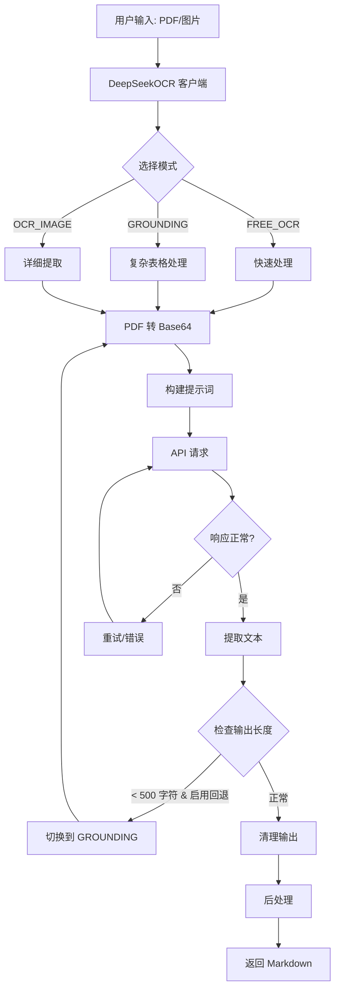

# 简介

[](https://pypi.org/project/multi-ocr-sdk/)
[](https://opensource.org/licenses/MIT)
[](https://www.python.org/downloads/)
[](https://github.com/psf/black)

**MULTI-OCR-SDK** 是一个简单高效的 Python SDK，用于调用各类OCR API（现已支持deepseek-OCR、视觉模型VLM）。它提供了简洁、生产级的接口，可以高精度、高性能地将文档（PDF、图片）转换为 Markdown 文本。

本项目基于[DeepSeek-OCR-SDK](https://github.com/bukely/DeepSeek-OCR-SDK)进一步开发，感谢发起人[@BukeLy](https://github.com/BukeLy)对本项目的支持

# 核心特征

- **简单易用**：API 简洁直观，学习成本低
- **并发执行**：完整并发执行，快速处理多页文档
- **类型提示**：100% 类型覆盖，更好的 IDE 支持（还没实现）

# 安装

使用 pip

```bash
pip install multi-ocr-sdk
```

使用 uv（推荐）

```bash
uv add multi-ocr-sdk
```

从源码安装

```bash
# 克隆仓库
git clone https://github.com/B-Beginner/MULTI-OCR-SDK
cd MULTI-OCR-SDK
uv sync # 使用 uv 安装
pip install -e . # 或使用 pip 安装
```

# 视觉模型VLM使用方法

## 基础用法

```python
import os
from pprint import pprint
from multi_ocr_sdk import VLMClient


API_KEY = "your_api_key_here"
BASE_URL = "http://your_url/v1/chat/completions"
file_path = "./examples/example_files/DeepSeek_OCR_paper_mini.pdf" 

client = VLMClient(
    api_key='test_api_key', # 必填
    base_url='http://test.com/v1', # 必填，一般以/v1，或者/v1/completions结尾
    model='Qwen3-VL-8B', # 必填，模型名
    enable_log=True # 可选参数，是否启用日志功能
)

result = client.parse(
    file_path=file_path,
    prompt="你是一个ocr机器人，识别输入的文件内容，输出为markdown格式，尽可能保留图表等格式信息，你不需要评论概括文件内容，只需要输出就行",
    model="Qwen3-VL-8B",
    # timeout=100, # 可选参数，默认60s，如果文件很大，VLM需要处理很久，timeout需要设置长一些
    # dpi=60  # 可选参数，默认72，DPI越低，图片越糊，消耗的输入token越少，识别效果越差，自行调整至合适比例
    # pages=[1,2] # 可选参数，默认全部识别，如果是处理单张图片或者单页pdf不需要这个参数，如果是处理多页pdf可以通过这个参数处理指定页
    # concurrency_num=5,  # 可选参数，默认为1（即不并发），如果需要并发处理一个pdf里的多个页面，可以调高该参数
    # max_tokens=8000  # 可选参数，默认8192，每个模型支持的最大token数不同，不要设为模型上限，因为 prompt 也占 token；如果模型上限是8192，建议max_token略小一些，留出冗余给文字prompt，比如此处设为8000

)
print(result)
```

# DeepSeek-OCR使用方法

### 核心特性

- **三种 OCR 模式**：
  - `FREE_OCR`：快速模式，适用于 80% 的场景（3.95-10.95秒）
  - `GROUNDING`：高级模式，适用于复杂表格（5.18-8.31秒）
  - `OCR_IMAGE`：详细模式，提供词级别提取（19-26秒）
- **智能回退**：自动切换模式以获得更好的质量

### 快速开始

```python
from multi_ocr_sdk import DeepSeekOCR

# 初始化客户端（选择您的 API 提供商）
client = DeepSeekOCR(
    api_key="your_api_key",
    base_url="https://api.siliconflow.cn/v1/chat/completions"  # 或您的提供商端点
)

# 解析文档
text = client.parse("document.pdf")
print(text)
```

**注意**：本 SDK 支持任何提供 DeepSeek-OCR 模型的 OpenAI 兼容 API 端点。目前已知的提供商：**硅基流动** (`api.siliconflow.cn`)。DeepSeek 官方 API 不支持 DeepSeek-OCR 模型。

### 架构图



### 使用示例

#### 基础用法

```python
from multi_ocr_sdk import DeepSeekOCR

client = DeepSeekOCR(
    api_key="your_api_key",
    base_url="https://api.siliconflow.cn/v1/chat/completions"  # 或您的提供商端点
)

# 简单文档
text = client.parse("invoice.pdf", mode="free_ocr")

# 复杂表格
text = client.parse("statement.pdf", mode="grounding")

# 自定义 DPI
text = client.parse("document.pdf", dpi=300)
```

#### 多页 PDF 处理

```python
from multi_ocr_sdk import DeepSeekOCR

client = DeepSeekOCR(
    api_key="your_api_key",
    base_url="https://api.siliconflow.cn/v1/chat/completions"
)

# 处理所有页面（新的默认行为）
text = client.parse("multi_page.pdf")
# 返回: 第1页内容\n\n---\n\n第2页内容\n\n---\n\n第3页内容

# 只处理第一页（旧的行为）
text = client.parse("multi_page.pdf", pages=1)

# 处理特定页面（例如第 1、3、5 页）
text = client.parse("multi_page.pdf", pages=[1, 3, 5])

# 处理一个范围的页面
text = client.parse("multi_page.pdf", pages=list(range(1, 6)))  # 第 1-5 页
```

**注意**：处理多个页面将按比例增加 API 使用量和费用。每个页面都独立处理，并带有智能的逐页回退机制。

### 模式选择指南

| 文档类型               | 推荐模式      | 原因             |
| ---------------------- | ------------- | ---------------- |
| 简单文本（发票、信件） | `FREE_OCR`  | 最快，80% 准确率 |
| 复杂表格（≥20 行）    | `GROUNDING` | 更好的结构保留   |
| 简单表格（<10 行）     | `FREE_OCR`  | 避免截断问题     |
| 混合内容               | `GROUNDING` | 处理复杂性好     |

### 配置

#### 环境变量

```bash
export DS_OCR_API_KEY="your_api_key"
export DS_OCR_BASE_URL="https://api.siliconflow.cn/v1/chat/completions"  # 必填：设置为您的提供商端点
export DS_OCR_MODEL="deepseek-ai/DeepSeek-OCR"
export DS_OCR_TIMEOUT=60
export DS_OCR_MAX_TOKENS=4000
export DS_OCR_DPI=200
export DS_OCR_FALLBACK_ENABLED=true
export DS_OCR_FALLBACK_MODE="grounding"
export DS_OCR_MIN_OUTPUT_THRESHOLD=500
export DS_OCR_PAGE_SEPARATOR="\n\n---\n\n"  # Separator between pages in multi-page PDFs
export DS_OCR_REQUEST_DELAY=0.0  # 请求之间的延迟秒数（0 = 无延迟）
export DS_OCR_ENABLE_RATE_LIMIT_RETRY=true  # 启用 429 错误自动重试
export DS_OCR_MAX_RATE_LIMIT_RETRIES=3  # 速率限制错误的最大重试次数
export DS_OCR_RATE_LIMIT_RETRY_DELAY=5.0  # 重试前的初始延迟（使用指数退避）
```

**可用的 API 提供商**：

- **硅基流动（SiliconFlow）**：`https://api.siliconflow.cn/v1/chat/completions` (已验证 ✅)
- **其他**：联系第三方 API 提供商以获取 DeepSeek-OCR 支持

**注意**：DeepSeek 官方 API (`api.deepseek.com`) 不支持 DeepSeek-OCR 模型。

#### 编程式配置

```python
from multi_ocr_sdk import DeepSeekOCR, OCRConfig

# 方法 1：直接初始化
client = DeepSeekOCR(
    api_key="your_api_key",
    base_url="https://api.siliconflow.cn/v1/chat/completions",  # 或您的提供商端点
    timeout=120,
    dpi=300
)

# 方法 2：使用配置对象（需要设置 DS_OCR_BASE_URL 环境变量）
config = OCRConfig.from_env(api_key="your_api_key", dpi=300)
client = DeepSeekOCR(api_key=config.api_key, base_url=config.base_url)
```

### 速率限制

SDK 提供内置的速率限制功能，防止超过 API 限制（TPM/RPM）。

#### 手动速率控制

设置请求之间的延迟以保持在速率限制内：

```python
from multi_ocr_sdk import DeepSeekOCR

# 设置请求之间 2 秒延迟
client = DeepSeekOCR(
    api_key="your_api_key",
    base_url="https://api.siliconflow.cn/v1/chat/completions",
    request_delay=2.0  # API 请求之间的延迟秒数
)

# SDK 会自动在请求之间等待
text1 = client.parse("doc1.pdf")  # 立即发起请求
text2 = client.parse("doc2.pdf")  # 从上次请求起等待 2 秒
```

### DPI 推荐

- **150 DPI**：可能产生幻觉，不推荐
- **200 DPI**：⭐ 最佳平衡（推荐）
- **300 DPI**：文件更大，质量提升不明显

### 开发

#### 设置开发环境

```bash
# 克隆仓库
git clone https://github.com/B-Beginner/MULTI-OCR-SDK
cd DeepSeek-OCR-SDK

# 使用 uv 安装依赖
uv sync --all-extras

# 激活虚拟环境
source .venv/bin/activate  # Linux/Mac
# 或
.venv\\Scripts\\activate  # Windows
```

#### 运行测试

```bash
uv run pytest
```

#### 代码质量

> ⚠️ 以下命令暂时不可用，因依赖尚未完善，预计将在未来版本中支持。

```bash
# 格式化代码
uv run black multi_ocr_sdk/
uv run isort multi_ocr_sdk/

# 类型检查
uv run mypy multi_ocr_sdk/

# 代码检查
uv run flake8 multi_ocr_sdk/
```

### API 参考

完整的 API 文档请参见 [API_REFERENCE.md](docs/API_REFERENCE.md)。

### 许可证

本项目采用 MIT 许可证 - 详情请见 [LICENSE](LICENSE) 文件。

### 致谢

- [DeepSeek AI 提供的优秀 OCR 模型](https://github.com/deepseek-ai/DeepSeek-OCR/)

**免责声明**：这是一个非官方的第三方 SDK，与 DeepSeek AI 或任何 API 服务提供商无关联。用户需自行选择 API 提供商并遵守提供商的服务条款。
