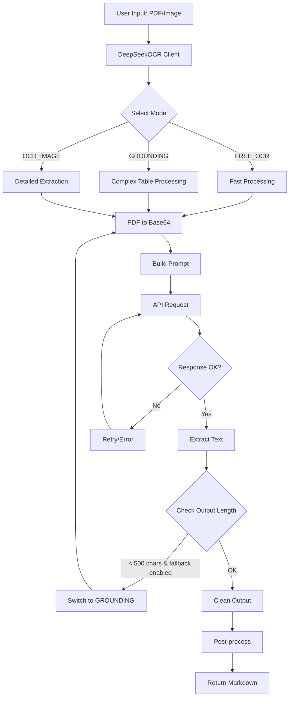
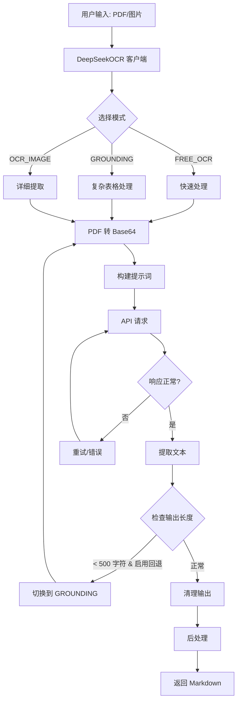

# DeepSeek-OCR-SDK

[](https://opensource.org/licenses/MIT)
[](https://www.python.org/downloads/)
[](https://github.com/psf/black)

[English](#english) | [中文](#中文)

---

<a name="english"></a>

## English

### Overview

**DeepSeek-OCR-SDK** is a simple and efficient Python SDK for the DeepSeek OCR API. It provides a clean, production-ready interface for converting documents (PDF, images) to Markdown text with high accuracy and performance.

### Key Features

- **Simple API**: Clean and intuitive interface, minimal learning curve
- **Three OCR Modes**:
  - `FREE_OCR`: Fast mode for 80% of use cases (3.95-10.95s)
  - `GROUNDING`: Advanced mode for complex tables (5.18-8.31s)
  - `OCR_IMAGE`: Detailed word-level extraction (19-26s)
- **Intelligent Fallback**: Automatically switches modes for better quality
- **Batch Processing**: Process multiple documents efficiently with progress tracking
- **Async & Sync**: Full support for both asynchronous and synchronous workflows
- **Type Hints**: 100% type coverage for better IDE support

### Installation

#### Using uv (recommended)

```bash
uv add deepseek-ocr
```

#### Using pip

```bash
pip install deepseek-ocr
```

### Quick Start

```python
from deepseek_ocr import DeepSeekOCR

# Initialize client
client = DeepSeekOCR(api_key="your_api_key")

# Parse document
text = client.parse("document.pdf")
print(text)
```

### Architecture



### Usage Examples

#### Basic Usage

```python
from deepseek_ocr import DeepSeekOCR

client = DeepSeekOCR(api_key="your_api_key")

# Simple document
text = client.parse("invoice.pdf", mode="free_ocr")

# Complex table
text = client.parse("statement.pdf", mode="grounding")

# Chinese document
text = client.parse("chinese.pdf", mode="free_ocr", chinese_hint=True)

# Custom DPI
text = client.parse("document.pdf", dpi=300)
```

#### Async Usage

```python
import asyncio
from deepseek_ocr import DeepSeekOCR

async def main():
    client = DeepSeekOCR(api_key="your_api_key")
    text = await client.parse_async("document.pdf")
    print(text)

asyncio.run(main())
```

#### Batch Processing

```python
import asyncio
from pathlib import Path
from deepseek_ocr import DeepSeekOCR, BatchProcessor

async def batch_example():
    client = DeepSeekOCR(api_key="your_api_key")
    processor = BatchProcessor(client, max_concurrent=5)

    files = list(Path("docs").glob("*.pdf"))
    summary = await processor.process_batch(
        files,
        mode="free_ocr",
        show_progress=True
    )

    summary.print_summary()

asyncio.run(batch_example())
```

### Mode Selection Guide

| Document Type | Recommended Mode | Reason |
|---------------|-----------------|---------|
| Simple text (invoice, letter) | `FREE_OCR` | Fastest, 80% accuracy |
| Complex tables (≥20 rows) | `GROUNDING` | Better structure preservation |
| Simple tables (<10 rows) | `FREE_OCR` | Avoids truncation issues |
| Chinese documents | `FREE_OCR` + `chinese_hint=True` | Best Chinese support |
| Mixed content | `GROUNDING` | Handles complexity well |

### Configuration

#### Environment Variables

```bash
export DS_OCR_API_KEY="your_api_key"
export DS_OCR_BASE_URL="https://api.siliconflow.cn/v1/chat/completions"
export DS_OCR_MODEL="deepseek-ai/DeepSeek-OCR"
export DS_OCR_TIMEOUT=60
export DS_OCR_MAX_TOKENS=4000
export DS_OCR_DPI=200
export DS_OCR_FALLBACK_ENABLED=true
export DS_OCR_FALLBACK_MODE="grounding"
export DS_OCR_MIN_OUTPUT_THRESHOLD=500
```

#### Programmatic Configuration

```python
from deepseek_ocr import DeepSeekOCR, OCRConfig

# Method 1: Direct initialization
client = DeepSeekOCR(
    api_key="your_api_key",
    base_url="https://api.siliconflow.cn/v1/chat/completions",
    timeout=120,
    dpi=300
)

# Method 2: Using config object
config = OCRConfig.from_env(api_key="your_api_key", dpi=300)
client = DeepSeekOCR(api_key=config.api_key)
```

### DPI Recommendations

- **150 DPI**: May cause hallucinations, not recommended
- **200 DPI**: ⭐ Optimal balance (recommended)
- **300 DPI**: Larger file size, minimal quality improvement

### Error Handling

```python
from deepseek_ocr import DeepSeekOCR, APIError, FileProcessingError

client = DeepSeekOCR(api_key="your_api_key")

try:
    text = client.parse("document.pdf")
except FileProcessingError as e:
    print(f"File error: {e}")
except APIError as e:
    print(f"API error: {e.status_code} - {e}")
except Exception as e:
    print(f"Unexpected error: {e}")
```

### Development

#### Setup Development Environment

```bash
# Clone repository
git clone https://github.com/yourusername/deepseek-ocr-sdk.git
cd deepseek-ocr-sdk

# Install dependencies with uv
uv sync --all-extras

# Activate virtual environment
source .venv/bin/activate  # Linux/Mac
# or
.venv\\Scripts\\activate  # Windows
```

#### Run Tests

```bash
uv run pytest
```

#### Code Quality

```bash
# Format code
uv run black deepseek_ocr/
uv run isort deepseek_ocr/

# Type checking
uv run mypy deepseek_ocr/

# Linting
uv run flake8 deepseek_ocr/
```

### Performance Benchmarks

See [BENCHMARKS.md](docs/BENCHMARKS.md) for detailed performance comparisons with MinerU and Docling.

### API Reference

See [API_REFERENCE.md](docs/API_REFERENCE.md) for complete API documentation.

### Contributing

Contributions are welcome! Please feel free to submit a Pull Request.

### License

This project is licensed under the MIT License - see the [LICENSE](LICENSE) file for details.

### Acknowledgments

- DeepSeek AI for the excellent OCR API
- SiliconFlow for providing API access

---

<a name="中文"></a>

## 中文

### 简介

**DeepSeek-OCR-SDK** 是一个简单高效的 Python SDK，用于调用 DeepSeek OCR API。它提供了简洁、生产级的接口，可以高精度、高性能地将文档（PDF、图片）转换为 Markdown 文本。

### 核心特性

- **简单易用**：API 简洁直观，学习成本低
- **三种 OCR 模式**：
  - `FREE_OCR`：快速模式，适用于 80% 的场景（3.95-10.95秒）
  - `GROUNDING`：高级模式，适用于复杂表格（5.18-8.31秒）
  - `OCR_IMAGE`：详细模式，提供词级别提取（19-26秒）
- **智能回退**：自动切换模式以获得更好的质量
- **批量处理**：高效处理多个文档，带进度跟踪
- **异步 & 同步**：完整支持异步和同步工作流
- **类型提示**：100% 类型覆盖，更好的 IDE 支持

### 安装

#### 使用 uv（推荐）

```bash
uv add deepseek-ocr
```

#### 使用 pip

```bash
pip install deepseek-ocr
```

### 快速开始

```python
from deepseek_ocr import DeepSeekOCR

# 初始化客户端
client = DeepSeekOCR(api_key="your_api_key")

# 解析文档
text = client.parse("document.pdf")
print(text)
```

### 架构图



### 使用示例

#### 基础用法

```python
from deepseek_ocr import DeepSeekOCR

client = DeepSeekOCR(api_key="your_api_key")

# 简单文档
text = client.parse("invoice.pdf", mode="free_ocr")

# 复杂表格
text = client.parse("statement.pdf", mode="grounding")

# 中文文档
text = client.parse("chinese.pdf", mode="free_ocr", chinese_hint=True)

# 自定义 DPI
text = client.parse("document.pdf", dpi=300)
```

#### 异步用法

```python
import asyncio
from deepseek_ocr import DeepSeekOCR

async def main():
    client = DeepSeekOCR(api_key="your_api_key")
    text = await client.parse_async("document.pdf")
    print(text)

asyncio.run(main())
```

#### 批量处理

```python
import asyncio
from pathlib import Path
from deepseek_ocr import DeepSeekOCR, BatchProcessor

async def batch_example():
    client = DeepSeekOCR(api_key="your_api_key")
    processor = BatchProcessor(client, max_concurrent=5)

    files = list(Path("docs").glob("*.pdf"))
    summary = await processor.process_batch(
        files,
        mode="free_ocr",
        show_progress=True
    )

    summary.print_summary()

asyncio.run(batch_example())
```

### 模式选择指南

| 文档类型 | 推荐模式 | 原因 |
|---------|---------|------|
| 简单文本（发票、信件） | `FREE_OCR` | 最快，80% 准确率 |
| 复杂表格（≥20 行） | `GROUNDING` | 更好的结构保留 |
| 简单表格（<10 行） | `FREE_OCR` | 避免截断问题 |
| 中文文档 | `FREE_OCR` + `chinese_hint=True` | 最佳中文支持 |
| 混合内容 | `GROUNDING` | 处理复杂性好 |

### 配置

#### 环境变量

```bash
export DS_OCR_API_KEY="your_api_key"
export DS_OCR_BASE_URL="https://api.siliconflow.cn/v1/chat/completions"
export DS_OCR_MODEL="deepseek-ai/DeepSeek-OCR"
export DS_OCR_TIMEOUT=60
export DS_OCR_MAX_TOKENS=4000
export DS_OCR_DPI=200
export DS_OCR_FALLBACK_ENABLED=true
export DS_OCR_FALLBACK_MODE="grounding"
export DS_OCR_MIN_OUTPUT_THRESHOLD=500
```

#### 编程式配置

```python
from deepseek_ocr import DeepSeekOCR, OCRConfig

# 方法 1：直接初始化
client = DeepSeekOCR(
    api_key="your_api_key",
    base_url="https://api.siliconflow.cn/v1/chat/completions",
    timeout=120,
    dpi=300
)

# 方法 2：使用配置对象
config = OCRConfig.from_env(api_key="your_api_key", dpi=300)
client = DeepSeekOCR(api_key=config.api_key)
```

### DPI 推荐

- **150 DPI**：可能产生幻觉，不推荐
- **200 DPI**：⭐ 最佳平衡（推荐）
- **300 DPI**：文件更大，质量提升不明显

### 错误处理

```python
from deepseek_ocr import DeepSeekOCR, APIError, FileProcessingError

client = DeepSeekOCR(api_key="your_api_key")

try:
    text = client.parse("document.pdf")
except FileProcessingError as e:
    print(f"文件错误: {e}")
except APIError as e:
    print(f"API 错误: {e.status_code} - {e}")
except Exception as e:
    print(f"未预期的错误: {e}")
```

### 开发

#### 设置开发环境

```bash
# 克隆仓库
git clone https://github.com/yourusername/deepseek-ocr-sdk.git
cd deepseek-ocr-sdk

# 使用 uv 安装依赖
uv sync --all-extras

# 激活虚拟环境
source .venv/bin/activate  # Linux/Mac
# 或
.venv\\Scripts\\activate  # Windows
```

#### 运行测试

```bash
uv run pytest
```

#### 代码质量

```bash
# 格式化代码
uv run black deepseek_ocr/
uv run isort deepseek_ocr/

# 类型检查
uv run mypy deepseek_ocr/

# 代码检查
uv run flake8 deepseek_ocr/
```

### 性能基准

详细的性能对比（与 MinerU、Docling 等）请参见 [BENCHMARKS.md](docs/BENCHMARKS.md)。

### API 参考

完整的 API 文档请参见 [API_REFERENCE.md](docs/API_REFERENCE.md)。

### 贡献

欢迎贡献！请随时提交 Pull Request。

### 许可证

本项目采用 MIT 许可证 - 详情请见 [LICENSE](LICENSE) 文件。

### 致谢

- DeepSeek AI 提供的优秀 OCR API
- SiliconFlow 提供的 API 访问
