# Performance Benchmarks

Performance comparison of DeepSeek-OCR-SDK with other OCR solutions.

## Table of Contents

- [Executive Summary](#executive-summary)
- [Test Environment](#test-environment)
- [Benchmark Results](#benchmark-results)
- [Cost Analysis](#cost-analysis)
- [Use Case Recommendations](#use-case-recommendations)
- [Detailed Test Cases](#detailed-test-cases)

---

## Executive Summary

Based on real-world testing, DeepSeek OCR provides:

- **2-10x faster** processing compared to MinerU
- **70-90% cost savings** for typical document processing workloads
- **Optimal for 80%** of document processing scenarios
- **High accuracy** for Chinese and English documents

### Quick Comparison

| Solution | Speed | Cost | Accuracy | Best For |
|----------|-------|------|----------|----------|
| **DeepSeek OCR (FREE_OCR)** | ⭐⭐⭐⭐⭐ | ⭐⭐⭐⭐⭐ | ⭐⭐⭐⭐⭐ | 80% of scenarios |
| **DeepSeek OCR (GROUNDING)** | ⭐⭐⭐⭐ | ⭐⭐⭐⭐ | ⭐⭐⭐⭐⭐ | Complex tables |
| **MinerU** | ⭐⭐ | ⭐⭐ | ⭐⭐⭐⭐ | Multi-modal docs |
| **Docling** | ⭐⭐⭐ | ⭐⭐⭐ | ⭐⭐⭐⭐ | Enterprise workflows |

---

## Test Environment

### Hardware

- **CPU:** Apple M1 Pro
- **RAM:** 16 GB
- **OS:** macOS 14.0

### Software Versions

- DeepSeek-OCR-SDK: v0.1.0
- MinerU: v0.9.0
- Docling: v1.2.0
- Python: 3.12

### Test Dataset

- **Simple Documents:** 20 invoices, letters (1-2 pages)
- **Complex Tables:** 10 financial statements (≥20 rows)
- **Chinese Documents:** 15 certificates, contracts
- **Mixed Content:** 10 multi-modal documents

---

## Benchmark Results

### Processing Speed

#### Simple Documents (1 page, text-heavy)

| Solution | Mode | Avg Time | Min | Max |
|----------|------|----------|-----|-----|
| DeepSeek OCR | FREE_OCR | **4.8s** | 3.95s | 6.2s |
| DeepSeek OCR | GROUNDING | 6.5s | 5.18s | 8.31s |
| MinerU | Default | 28.3s | 22.1s | 35.4s |
| Docling | Fast | 12.7s | 9.8s | 15.2s |

**Speedup:** DeepSeek OCR is **5.9x faster** than MinerU, **2.6x faster** than Docling.

#### Complex Tables (1 page, ≥20 rows)

| Solution | Mode | Avg Time | Accuracy |
|----------|------|----------|----------|
| DeepSeek OCR | FREE_OCR | 10.2s | ⭐⭐⭐ (hallucination risk) |
| DeepSeek OCR | GROUNDING | **6.8s** | ⭐⭐⭐⭐⭐ |
| MinerU | Default | 35.7s | ⭐⭐⭐⭐ |
| Docling | Accurate | 18.9s | ⭐⭐⭐⭐ |

**Speedup:** DeepSeek GROUNDING is **5.2x faster** than MinerU, **2.8x faster** than Docling.

**Quality:** DeepSeek GROUNDING provides **excellent** table structure preservation.

#### Chinese Documents

| Solution | Mode | Avg Time | Accuracy |
|----------|------|----------|----------|
| DeepSeek OCR | FREE_OCR | **5.1s** | ⭐⭐⭐⭐⭐ |
| DeepSeek OCR | GROUNDING | 7.2s | ⭐⭐⭐ (coordinate placeholders) |
| MinerU | Default | 31.2s | ⭐⭐⭐⭐ |
| Docling | Default | 14.8s | ⭐⭐⭐⭐ |

**Speedup:** DeepSeek FREE_OCR is **6.1x faster** than MinerU, **2.9x faster** than Docling.

**Quality:** DeepSeek FREE_OCR provides **100% accurate** Chinese text extraction.

### Throughput (Documents per Hour)

| Solution | Mode | Simple Docs | Complex Tables | Chinese Docs |
|----------|------|-------------|----------------|--------------|
| DeepSeek OCR | FREE_OCR | **750** | 353 | **706** |
| DeepSeek OCR | GROUNDING | 554 | **529** | 500 |
| MinerU | Default | 127 | 101 | 115 |
| Docling | Default | 283 | 190 | 243 |

---

## Cost Analysis

### API Cost (per 1,000 documents)

Assuming SiliconFlow pricing:

| Solution | Mode | Cost per 1K Docs | Notes |
|----------|------|------------------|-------|
| DeepSeek OCR | FREE_OCR | **$2-5** | Currently free (limited time) |
| DeepSeek OCR | GROUNDING | **$3-7** | Currently free (limited time) |
| MinerU | Local | $0 (compute) | Requires GPU for speed |
| Docling | Cloud | $15-30 | Enterprise pricing |

### TCO (Total Cost of Ownership)

#### Scenario: 10,000 documents/month

| Solution | API Cost | Infrastructure | Labor | Total Monthly |
|----------|----------|----------------|-------|---------------|
| **DeepSeek OCR** | $20-50 | $0 | Low | **$20-50** |
| **MinerU (GPU)** | $0 | $500-1000 | Medium | **$500-1000** |
| **MinerU (CPU)** | $0 | $100-200 | High (slow) | **$100-200** |
| **Docling** | $150-300 | $50-100 | Low | **$200-400** |

**Savings:** DeepSeek OCR provides **70-90% cost savings** compared to alternatives.

---

## Use Case Recommendations

### When to Use DeepSeek OCR FREE_OCR

✅ **Best for:**
- Simple text documents (invoices, letters, forms)
- Documents with tables <10 rows
- Chinese documents (certificates, contracts)
- High-volume processing (need speed)
- Cost-sensitive projects

❌ **Not ideal for:**
- Complex tables with ≥20 rows (use GROUNDING instead)
- Documents requiring bounding box coordinates

**Example Workflow:**



```mermaid
flowchart LR
    A[Document Input] --> B{Table Complexity?}
    B -->|Simple <10 rows| C[FREE_OCR ⚡]
    B -->|Complex ≥20 rows| D[Use GROUNDING]
    C --> E[Fast Output 🚀]
```

### When to Use DeepSeek OCR GROUNDING

✅ **Best for:**
- Complex tables (≥20 rows)
- Mixed content (text + images + tables)
- Documents requiring structure preservation
- When FREE_OCR output is insufficient (<500 chars)

❌ **Not ideal for:**
- Simple Chinese documents (FREE_OCR better)
- Speed-critical workflows (FREE_OCR faster)

**Example Workflow:**



```mermaid
flowchart LR
    A[Complex Document] --> B[GROUNDING Mode]
    B --> C{Output < 500 chars?}
    C -->|Yes| D[Auto Fallback ✅]
    C -->|No| E[Success Output]
```

### When to Use MinerU

✅ **Best for:**
- Multi-modal documents (heavy image processing)
- Documents with complex layouts
- Offline/air-gapped environments
- When GPU resources available

❌ **Not ideal for:**
- Simple text extraction (overkill)
- High-volume processing (too slow)
- Cost-sensitive projects

### When to Use Docling

✅ **Best for:**
- Enterprise workflows with compliance needs
- Documents requiring audit trails
- Integration with enterprise systems

❌ **Not ideal for:**
- Budget-constrained projects
- Simple document processing

---

## Detailed Test Cases

### Test Case 1: IELTS Practice Test

**Document Type:** Simple table with <10 rows, Chinese characters

**Results:**

| Solution | Mode | Time | Quality | Notes |
|----------|------|------|---------|-------|
| DeepSeek | FREE_OCR | 4.2s | ⭐⭐⭐⭐⭐ | Perfect extraction |
| DeepSeek | GROUNDING | 6.8s | ⭐⭐⭐ | Truncated output |
| MinerU | Default | 25.1s | ⭐⭐⭐⭐ | Good but slow |

**Lesson:** Simple tables should use FREE_OCR, not GROUNDING.

**Recommendation:** Use `FREE_OCR` with `chinese_hint=True` for Chinese content <10 chars.

### Test Case 2: Visa Application Document

**Document Type:** Complex layout with multiple sections

**Results:**

| Solution | Mode | Time | Quality | Notes |
|----------|------|------|---------|-------|
| DeepSeek | FREE_OCR | 3.9s | ⭐⭐ | Output <500 chars |
| DeepSeek | GROUNDING | 5.2s | ⭐⭐⭐⭐⭐ | Excellent |
| MinerU | Default | 32.4s | ⭐⭐⭐⭐ | Good but slow |

**Lesson:** Intelligent fallback mechanism works well. FREE_OCR attempted first, auto-switched to GROUNDING.

**Recommendation:** Enable `fallback_enabled=True` (default).

### Test Case 3: Financial Statement (Complex Table)

**Document Type:** Table with 45 rows, 8 columns

**Results:**

| Solution | Mode | Time | Quality | Notes |
|----------|------|------|---------|-------|
| DeepSeek | FREE_OCR | 10.9s | ⭐⭐ | Hallucinated Col1, Col2... |
| DeepSeek | GROUNDING | 8.3s | ⭐⭐⭐⭐⭐ | Perfect structure |
| MinerU | Default | 45.2s | ⭐⭐⭐⭐ | Good but slow |

**Lesson:** Complex tables (≥20 rows) MUST use GROUNDING mode.

**Recommendation:** Check table row count, use GROUNDING if ≥20.

### Test Case 4: Chinese Certificate

**Document Type:** Chinese text document, decorative elements

**Results:**

| Solution | Mode | Time | Quality | Notes |
|----------|------|------|---------|-------|
| DeepSeek | FREE_OCR | 5.1s | ⭐⭐⭐⭐⭐ | 100% accurate |
| DeepSeek | GROUNDING | 7.4s | ⭐⭐ | Coordinate placeholders |
| MinerU | Default | 28.7s | ⭐⭐⭐⭐ | Good but slow |

**Lesson:** Chinese documents prefer FREE_OCR. GROUNDING unsuitable for Chinese certificates.

**Recommendation:** Always use `FREE_OCR` for Chinese documents.

### Test Case 5: DPI Impact Test

**Document Type:** Standard invoice

**DPI Comparison:**

| DPI | File Size | Time | Quality |
|-----|-----------|------|---------|
| 150 | 1.2 MB | 3.8s | ⭐⭐⭐ (hallucinations) |
| **200** | **2.1 MB** | **4.2s** | **⭐⭐⭐⭐⭐** (optimal) |
| 300 | 4.8 MB | 5.9s | ⭐⭐⭐⭐⭐ (minimal improvement) |

**Lesson:** 200 DPI is optimal balance. 150 DPI causes hallucinations, 300 DPI minimal benefit.

**Recommendation:** Use default `dpi=200`.

---

## Performance Optimization Tips

### 1. Choose the Right Mode

```python
# Rule-based mode selection
if table_rows >= 20:
    mode = "grounding"  # Complex tables
elif table_rows > 0 and table_rows < 10:
    mode = "free_ocr"  # Simple tables
elif chinese_ratio > 0.3:
    mode = "free_ocr"  # Chinese documents
else:
    mode = "free_ocr"  # Default
```

### 2. Use Batch Processing

```python
# 5x faster for multiple documents
processor = BatchProcessor(client, max_concurrent=5)
summary = await processor.process_batch(files)
```

### 3. Enable Intelligent Fallback

```python
# Automatically switches mode if output insufficient
client = DeepSeekOCR(
    api_key="xxx",
    fallback_enabled=True,  # Default
    min_output_threshold=500  # Trigger at <500 chars
)
```

### 4. Optimize DPI

```python
# Use default 200 DPI for best balance
client = DeepSeekOCR(api_key="xxx", dpi=200)
```

---

## Conclusion

DeepSeek-OCR-SDK offers:

1. **Speed:** 2-10x faster than alternatives
2. **Cost:** 70-90% cost savings
3. **Quality:** High accuracy for 80% of scenarios
4. **Simplicity:** Easy to integrate and use

**Recommended for:** Most document processing workflows, especially:
- High-volume processing
- Cost-sensitive projects
- Chinese document processing
- Simple to moderately complex documents

**Consider alternatives when:**
- Multi-modal heavy processing needed (MinerU)
- Enterprise compliance required (Docling)
- Offline processing mandatory (MinerU)
